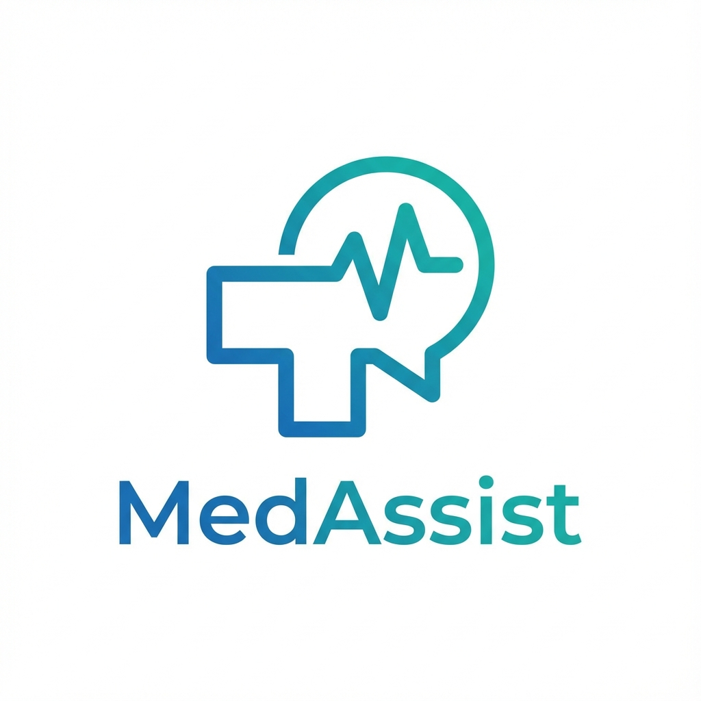

# 🏥 MedAssist - AI-Powered Medical Triage Assistant

<div align="center">



**A modern, bilingual (English/Nepali) AI-powered medical triage system designed for accessibility in rural and urban Nepal.**

[](https://nextjs.org/)
[](https://www.typescriptlang.org/)
[](https://tailwindcss.com/)
[](https://azure.microsoft.com/en-us/products/cognitive-services/openai-service/)

</div>

---

<div align="center">

Check out live at: **med-assist-ten.vercel.app**

</div>

## 📋 Table of Contents

- [Overview](#-overview)
- [Key Features](#-key-features)
- [Tech Stack](#-tech-stack)
- [Prerequisites](#-prerequisites)
- [Installation](#-installation)
- [Environment Setup](#-environment-setup)
- [Running the App](#-running-the-app)
- [How to Use](#-how-to-use)
- [Project Structure](#-project-structure)
- [Future Features](#-future-features)
- [Contributing](#-contributing)

---

## 🎯 Overview

**MedAssist** is an intelligent medical triage assistant built with Next.js and powered by Azure OpenAI (GPT-4/GPT-4o). It provides:

- **Instant Medical Guidance**: AI-powered symptom analysis and preliminary diagnosis
- **Bilingual Support**: Full support for English and Nepali (Devanagari script)
- **Voice Interface**: Speak your symptoms, hear the diagnosis
- **Medical Report Analysis**: Upload prescriptions and lab reports for AI interpretation
- **Rural-Focused Tools**: Offline first-aid guides, visual body map, health post locator
- **Smart Questioning**: AI asks minimal, targeted Yes/No or MCQ questions for faster diagnosis

**Built for accessibility** - designed to work in low-literacy, low-connectivity environments across Nepal.

---

## ✨ Key Features

### 🤖 AI-Powered Triage

- **Clinical Tone**: Direct, no-nonsense medical guidance
- **Smart Questions**: Minimal MCQ/Yes-No questions for efficiency
- **Urgency Detection**: Automatically identifies Emergency/High/Low urgency cases
- **Bilingual**: Responds in user's language (English or Nepali)

### 🎤 Voice Integration

- **Speech-to-Text**: Describe symptoms by voice (supports Nepali & English)
- **Text-to-Speech**: Hear AI responses aloud
- **Adaptive Speed**: Faster playback for English, normal for Nepali/Hindi

### 📸 Medical Report Analysis (Vision)

- **Upload Reports**: Analyze prescriptions, lab reports, X-rays
- **Safety First**: Politely declines to analyze injury photos (reports only)
- **Instant Insights**: Extracts findings and provides precautions

### 🌐 Rural Health Tools

1. **Offline First Aid** - Emergency guides for snake bites, burns, fractures
2. **Visual Body Map** - Click on body parts to describe pain (bilingual)
3. **Health Post Finder** - District-based list of nearby health centers

### � Session Management

- **Persistent History**: ChatGPT-style conversation history
- **New Chat Anytime**: Start fresh consultations
- **Cross-Device**: LocalStorage-based storage

---

## 🛠️ Tech Stack

| Category       | Technology                         |
| -------------- | ---------------------------------- |
| **Framework**  | Next.js 16 (App Router, Turbopack) |
| **Language**   | TypeScript                         |
| **Styling**    | Tailwind CSS 4.x                   |
| **AI**         | Azure OpenAI (GPT-4o/GPT-4 Vision) |
| **Voice**      | Web Speech API (Browser Native)    |
| **Icons**      | Lucide React                       |
| **Deployment** | Vercel / Any Node.js host          |

---

## 📦 Prerequisites

Before you begin, ensure you have:

- **Node.js** 18.x or higher ([Download](https://nodejs.org/))
- **npm** or **yarn** package manager
- **Azure OpenAI API Key** & Endpoint ([Get Access](https://azure.microsoft.com/en-us/products/cognitive-services/openai-service/))

---

## 🚀 Installation

### 1️⃣ Clone the Repository

```bash
git clone https://github.com/SarshijKarn/MedAssist.git
cd med-assist
```

### 2️⃣ Install Dependencies

```bash
npm install
# or
yarn install
```

---

## 🔐 Environment Setup

Create a `.env.local` file in the project root:

```env
# Azure OpenAI Configuration
GPT_API_KEY=your_azure_openai_api_key_here
GPT_ENDPOINT=https://your-resource-name.openai.azure.com/
GPT_DEPLOYMENT_NAME=your-deployment-name
```

### How to Get These Values:

1. **GPT_API_KEY**: From Azure Portal → Your OpenAI Resource → Keys and Endpoint
2. **GPT_ENDPOINT**: Same location (format: `https://<resource-name>.openai.azure.com/`)
3. **GPT_DEPLOYMENT_NAME**: Your deployment name (e.g., `gpt-4o`, `gpt-35-turbo`)

> ⚠️ **Security Note**: Never commit `.env.local` to version control. It's already in `.gitignore`.

---

## ▶️ Running the App

### Development Mode

```bash
npm run dev
```

The app will start at **http://localhost:3000** (or port 3001 if 3000 is in use)

### Production Build

```bash
npm run build
npm start
```

---

## 📖 How to Use

### **1. Starting a Consultation**

1. Open the app in your browser
2. You'll see the MedAssist welcome screen
3. Choose an option:
   - **Quick Actions**: Tap common symptoms (Fever, Headache, etc.)
   - **Type**: Describe your symptoms in the text box
   - **Voice**: Tap the microphone icon and speak

### **2. Language Selection**

- **EN/NE Toggle**: Switch between English and Nepali input
- The AI automatically detects your language and responds accordingly

### **3. Answering AI Questions**

- The AI will ask targeted questions
- Click **Yes/No buttons** or **Multiple Choice options** when available
- Type detailed answers only when necessary

### **4. Understanding Responses**

- **Urgency Badge**: High/Emergency cases show a red/orange badge
- **Recommendations**: Follow the AI's step-by-step guidance
- **Voice Output**: Tap the speaker icon to hear responses

### **5. Using Rural Tools**

#### 🩹 **First Aid (Offline)**

1. Tap **"First Aid"** button in the header
2. Select a topic (Snake Bite, Burns, Fracture, Fever)
3. Read Do's and Don'ts (works offline)

#### 🧍 **Body Map**

1. Tap **"Body Map"** button
2. Click on the body part that hurts
3. The AI receives your input: "I have pain in my [body part]"

#### 🏥 **Health Centers**

1. Tap **"Centers"** button
2. Select your district
3. View nearby health posts with phone numbers

### **6. Uploading Medical Reports**

1. Tap the **📎 Paperclip icon** in the input area
2. Select an image of your medical report/prescription
3. Add optional text (e.g., "What does this mean?")
4. Send
5. AI analyzes the report and explains findings

> ⚠️ **Note**: Only upload medical documents. The AI will decline to analyze photos of injuries.

### **7. Managing Conversations**

- **New Chat**: Tap the **"+"** button in the sidebar
- **View History**: Click on previous chats in the sidebar
- **Clear All**: Use "Clear History" option
- **Hamburger Menu**: Tap ☰ on mobile to toggle sidebar

---

## 📁 Project Structure

```
med-assist/
├── app/
│   ├── api/
│   │   └── medassist/
│   │       └── route.ts          # Main AI API endpoint
│   ├── globals.css               # Global styles
│   ├── layout.tsx                # Root layout
│   └── page.tsx                  # Home page
├── components/
│   ├── ChatInterface.tsx         # Main chat UI
│   ├── MessageComposer.tsx       # Input area (text/voice/upload)
│   ├── HistoryPanel.tsx          # Sidebar with chat history
│   ├── FirstAidModal.tsx         # Offline first-aid guide
│   ├── BodyMapModal.tsx          # Visual body selector
│   └── HealthPostFinder.tsx      # Health center locator
├── lib/
│   └── utils.ts                  # Utility functions (cn)
├── public/
│   └── logo.png                  # MedAssist logo
├── .env.local                    # Environment variables (not committed)
├── package.json                  # Dependencies
├── tailwind.config.ts            # Tailwind configuration
└── README.md                     # This file
```

---

## 🔮 Future Features

Planned enhancements:

- [ ] **Medicine Scanner**: Identify pills from photos
- [ ] **Prescription Reminder**: Auto-schedule medicine alerts
- [ ] **Telemedicine Handover**: Connect urgent cases to real doctors
- [ ] **Multi-Profile**: Support family members (child/adult/elderly)
- [ ] **PDF Report Support**: Analyze PDF lab reports
- [ ] **Local Dialect Support**: Maithili, Bhojpuri, Tamang voices

See [`future_features.md`](future_features.md) for details.

---

## 🤝 Contributing

Contributions are welcome! To contribute:

1. Fork the repository
2. Create a feature branch (`git checkout -b feature/AmazingFeature`)
3. Commit changes (`git commit -m 'Add AmazingFeature'`)
4. Push to branch (`git push origin feature/AmazingFeature`)
5. Open a Pull Request

---

## � License

This project is licensed under the **MIT License** - see the [LICENSE](LICENSE) file for details.

---

## 🙏 Acknowledgments

- **Azure OpenAI** for powering the AI engine
- **Lucide Icons** for beautiful iconography
- **Tailwind Labs** for the styling framework
- **Vercel** for Next.js and hosting

---

## 🆘 Support

**For Emergencies**: Call **100** (Police) or **102** (Ambulance) in Nepal

**For App Issues**: Open an issue on [GitHub Issues](https://github.com/SarshijKarn)

---

<div align="center">

**Built with ❤️ for accessible healthcare in Nepal**

[Report Bug](https://github.com/SarshijKarn) · [Request Feature](https://github.com/SarshijKarn)

</div>

---
<div align="center">

### Created with ❤️ by Sarshij Karn

[](https://sarshijkarn.com.np)
[](https://www.linkedin.com/in/sarshij-karn-1a7766236/)

</div>
